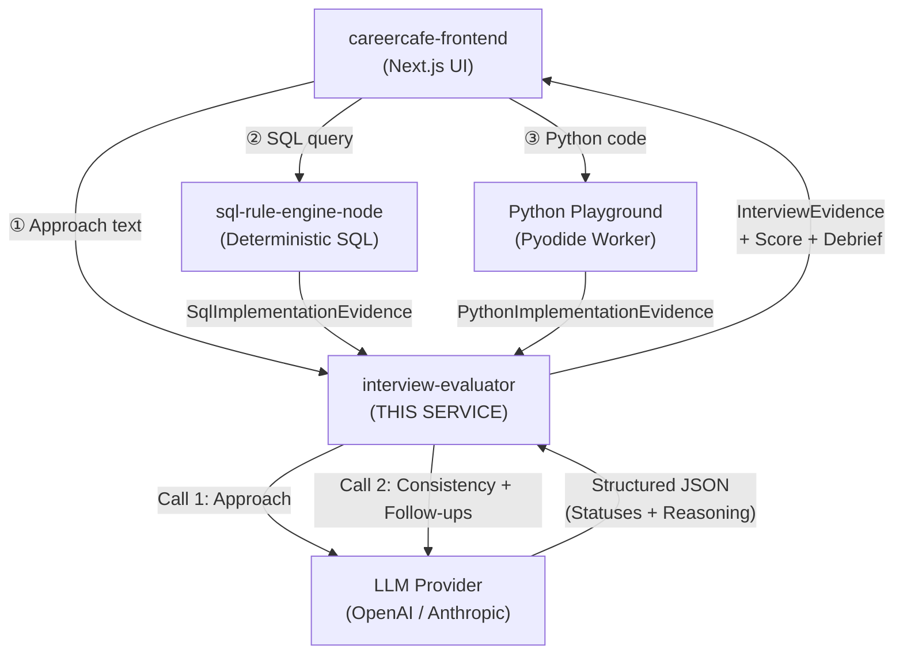
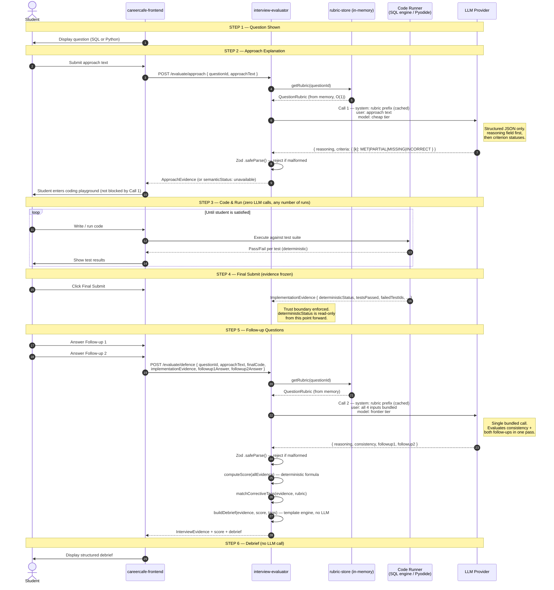

# Interview Evaluator — CareerCafe AI Reasoning Engine


> A lean, cost-efficient backend service that grades **how a student thinks** during a mock coding interview — not whether their code compiles.
> Built for CareerCafe's SQL + Python interview track. Stateless. Strict. Swappable.

---

## Live Resources

| Resource | Link |
|---|---|
| **Full System Design Doc** | [`DESIGN.md`](./DESIGN.md) |
| **Changelog & Build Status** | [`CHANGELOG.md`](./CHANGELOG.md) |
| API Contract (Zod Schemas) | [`src/schemas/evidence.ts`](./interview-evaluator/src/schemas/evidence.ts) |
| Rubric Contract | [`src/schemas/rubric.ts`](./interview-evaluator/src/schemas/rubric.ts) |
| SQL Rubrics (8 Questions) | [`src/rubrics/sql/`](./interview-evaluator/src/rubrics/sql/) |
| Branching Policy | [`BRANCHING.md`](./BRANCHING.md) |
| Engineering Workflow | [`WORKFLOW.md`](./WORKFLOW.md) |
| AI Agent Rules | [`AGENTS.md`](./AGENTS.md) |
| Environment Template | [`.env.sample`](./interview-evaluator/.env.sample) |

---

## The Core Idea — One Rule That Governs Everything

> **Deterministic systems decide if code is correct. This service decides if the reasoning was sound.**

Two systems already handle whether SQL or Python code is *right*: the `sql-rule-engine-node` and a browser-based Pyodide test runner. This service never touches those verdicts. It only answers:

- Did the student explain a sensible plan before they coded?
- Did what they coded match what they said they'd do?
- Could they defend their choices under follow-up questioning?

That separation is not just a design preference — it is enforced in the code. The `deterministicStatus` field in every evidence payload is set *before* this service receives it and this service has zero write access to it.

---

## System Architecture

> The diagram below is defined as code (Mermaid.js) and renders natively on GitHub.
> It shows **permanent architectural relationships and data contracts** — not build status.
> For what is currently built vs. pending, see [`CHANGELOG.md`](./CHANGELOG.md).



### Architecture Components

| Service | Technology | Hosting Platform | Description |
|---|---|---|---|
| **Frontend** | Next.js 16, React | Vercel | The student-facing interview UI. Hosts the coding environments and displays the final debrief. |
| **SQL Engine** | Node.js, SQLite | Render | Deterministic code runner that verifies SQL correctness before AI evaluation. |
| **Python Playground** | CodeMirror 6, Pyodide | Browser Worker | Deterministic code runner that executes Python locally in the student's browser. |
| **Interview Evaluator** | Express, Node.js, Zod | Render / Vercel | **(This repository).** The semantic reasoning engine. Grades student explanations against rubrics and computes the final score. |
| **LLM Provider** | GPT-4o / Claude 3.5 | External API | Swappable intelligence layer restricted exclusively to structured classification (JSON). |

> **The trust boundary:** `deterministicStatus` and test result fields flow *into* this service from the code runners. This service has no arrow pointing back to modify them. That is the architectural guarantee.


## Request Lifecycle — Full Sequence

> Defined as a Mermaid sequence diagram. Renders natively on GitHub.
> Every actor, every message, and every decision boundary is permanent — this diagram describes the protocol, not the build state.



> **Two LLM calls total, per interview session.** Code runs are free. Debrief assembly is free.

---

## Cost & Optimization Strategy

This is a practice tool for freshers, not a hiring pipeline. Every design choice reflects that:

| Optimization | How We Achieve It |
|---|---|
| Hard cap at 2 LLM calls | Architecture enforced — no calls during coding, no call at debrief |
| Bundled Call 2 | Consistency + Follow-up 1 + Follow-up 2 evaluated in one single prompt, not three |
| Rubrics loaded at boot | All JSON rubrics read once into memory at startup. Zero file I/O per request. |
| LLM never scores numerically | The 0–10 score is computed by backend math. LLM only classifies (MET/PARTIAL/etc.) |
| Stateless service | No session state. Every request is self-contained. Easy to scale horizontally. |
| No premature infrastructure | No Redis, no queue, no cache — until there is a measured reason to add them |

---

## What the LLM Produces vs. What Our Backend Computes

| Output | Source | Method |
|---|---|---|
| Criterion statuses (MET / PARTIAL / MISSING / INCORRECT) | LLM — Call 1 & 2 | Structured JSON output, parsed and validated by Zod |
| Consistency verdict (matched / contradicted / etc.) | LLM — Call 2 | Structured JSON output |
| Qualitative evidence strings | LLM — Call 2 | Short free-text inside structured output |
| **0–10 numeric score** | **Backend logic only** | Fixed formula over statuses — LLM never outputs a number |
| Score cap (max 4.0 if approach was wrong) | Backend guard | Applied after scoring |
| Corrective tags | Backend rule-matching | Derived from rubric metadata + evidence statuses |
| Debrief text | Template engine | Pre-written, parameterized sentences — no LLM prose |

---

## LLM Failure Handling

| Failure Scenario | What Happens |
|---|---|
| Call 1 (Approach) times out or errors | Student is not blocked. Approach evidence marked `semanticStatus: "unavailable"`. Interview continues. |
| Call 2 (Consistency + Follow-ups) fails | AI evidence discarded entirely. Score computed from deterministic signals only. Debrief reflects missing semantic data. |
| LLM returns malformed JSON | Zod parse fails. System falls back to `"unavailable"` evidence. Never crashes the interview. |
| LLM response contradicts deterministic verdict | Trust boundary enforced: deterministic result is ground truth. AI verdict is silently ignored for the code correctness field. |

---

## Project Structure

```
sql_python_evaluator/
├── README.md                          ← You are here
├── WORKFLOW.md                        ← Engineering lifecycle & branch policy
│
└── interview-evaluator/
    ├── src/
    │   ├── index.ts                   ← Express app boot + /health route
    │   ├── config/
    │   │   └── env.ts                 ← Zod-validated env vars (fail-fast at boot)
    │   ├── schemas/
    │   │   ├── evidence.ts            ← InterviewEvidence, ApproachEvidence, etc.
    │   │   └── rubric.ts              ← QuestionRubric, FollowUpRubric
    │   ├── rubric-store/
    │   │   └── index.ts               ← Boot-time loader + getRubric() + listRubrics()
    │   ├── rubrics/
    │   │   ├── sql/                   ← 8 SQL rubric JSON files
    │   │   └── python/                ← (Pending — 5 question types)
    │   ├── routes/                    ← (Pending — approach.ts, defence.ts)
    │   ├── evaluators/                ← (Pending — approach & consistency evaluators)
    │   ├── llm/                       ← (Pending — swappable LLM provider adapter)
    │   ├── debrief/                   ← (Pending — template-driven debrief builder)
    │   ├── corrective-tags/           ← (Pending — rule-based tag matcher)
    │   └── queue/                     ← (Pending — async queue interface, not yet needed)
    ├── test/
    │   ├── schemas.test.ts            ← Zod schema unit tests (8/8 passing)
    │   └── rubric-store.test.ts       ← Rubric boot validation tests
    ├── benchmark/                     ← (Pending — 15 smoke cases for Python)
    ├── Dockerfile                     ← Multi-stage production build
    ├── docker-compose.yml             ← App + Postgres for local dev
    ├── drizzle.config.ts              ← ORM config
    └── .env.sample                    ← All required env vars with placeholder values
```

---

## Tech Stack

| Layer | Technology | Why |
|---|---|---|
| Runtime | Node.js 20 + TypeScript (strict) | Type safety enforced at every boundary |
| Web Framework | Express 5 | Lightweight, well-understood |
| Validation | Zod | Schema + type in one place; validates LLM output & request bodies |
| Package Manager | pnpm | Faster installs, strict dependency isolation |
| ORM | Drizzle + PostgreSQL | Type-safe queries, schema-as-code |
| Containerization | Docker (multi-stage) | Lean production image |
| Testing | Node native test runner + tsx | Zero dependencies, fast |

---

## Local Development

```bash
# 1. Clone and install
git clone https://github.com/swagatobauri/sql_python_evaluator.git
cd sql_python_evaluator/interview-evaluator
pnpm install

# 2. Set up environment
cp .env.sample .env
# Fill in DATABASE_URL, LLM_API_KEY, LLM_PROVIDER

# 3. Start dev server (hot reload)
pnpm dev

# 4. Verify it's alive
curl http://localhost:3000/health
# → {"status":"ok"}

# 5. Run all tests
./node_modules/.bin/tsx --test test/**/*.test.ts

# 6. Start with Docker (app + Postgres)
docker-compose up
```

---

## Environment Variables

| Variable | Required | Description |
|---|---|---|
| `DATABASE_URL` | ✅ Yes | PostgreSQL connection string |
| `LLM_API_KEY` | ✅ Yes | API key for your LLM provider |
| `LLM_PROVIDER` | ✅ Yes | `openai` or `anthropic` — swappable |
| `PORT` | ❌ Default: 3000 | Port the Express server listens on |
| `NODE_ENV` | ❌ Default: development | `development`, `production`, or `test` |

> If any required variable is missing at boot, the server refuses to start and prints a clear Zod validation error. No silent failures.

---

## Build & Deployment

```bash
# Build TypeScript to dist/
pnpm build

# Run production build
pnpm start

# Push DB schema
pnpm db:push

# Seed DB
pnpm db:seed

# Run benchmark suite
pnpm benchmark
```

**Docker Production Build:**
```bash
docker build -t interview-evaluator .
docker run -p 3000:3000 --env-file .env interview-evaluator
```

---

## Feature Roadmap

Every planned feature is tracked as a **GitHub Issue** on this repository.
Issues close automatically when their linked PR merges into `main`.
The live progress board always reflects actual state — no manual doc updates needed.

| Track | GitHub Link |
|---|---|
| All open issues | [github.com/swagatobauri/sql_python_evaluator/issues](https://github.com/swagatobauri/sql_python_evaluator/issues) |
| v0.1 milestone (scaffold + schemas) | [Milestone: v0.1](https://github.com/swagatobauri/sql_python_evaluator/milestone/1) |
| v0.2 milestone (rubric store + SQL rubrics) | [Milestone: v0.2](https://github.com/swagatobauri/sql_python_evaluator/milestone/2) |
| v0.3 milestone (evaluators + routes) | [Milestone: v0.3](https://github.com/swagatobauri/sql_python_evaluator/milestone/3) |
| v1.0 milestone (debrief + scoring + tags) | [Milestone: v1.0](https://github.com/swagatobauri/sql_python_evaluator/milestone/4) |

> For a human-readable summary of what shipped in each version, see [`CHANGELOG.md`](./CHANGELOG.md).

---

## Rubric Design Philosophy

Every rubric enforces one principle: **a question is measured on the reasoning patterns it is designed to surface, not just whether the output is correct.**

Each SQL rubric captures:
- **Expected approaches**: The 1–2 core strategies a strong candidate would describe.
- **Common mistakes**: The patterns that indicate conceptual misunderstanding (e.g., using `WHERE` instead of `HAVING`, using `=` to compare NULLs).
- **Follow-up questions**: Two pre-written probes that force the student to demonstrate depth (not just recall).
- **Critical misconceptions**: Specific wrong beliefs that, if expressed, signal a deeper gap and must be flagged.

> Rubric files are placeholder-plausible today and are flagged with a `"_comment"` key indicating they must be reconciled with the actual CareerCafe question bank before shipping.

---

*Last updated: August 2026 — Swagato Bauri*
